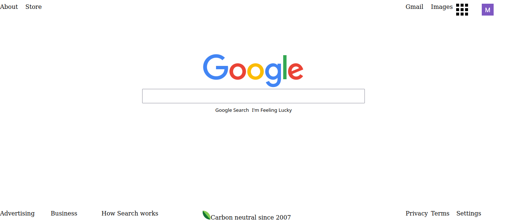

# Readme
# Google Homepage

## Overview

This was one of my first (if not the very first) projects using HTML and CSS.
The goals were to "deconstruct" the Google homepage and rebuild it,
thinking about how elements get placed on the page and roughly how they get 
styled and aligned, as well as getting acquainted with the browser's Dev Tools.

### Challenge

See the full design requirements from the Odin Project curriculum [here](https://web.archive.org/web/20210226070749/https://www.theodinproject.com/courses/foundations/lessons/html-css)

### Screenshot

  

### Links

- [Live site](https://mattdimicelli.github.io/google-homepage/)
- [Repo](https://github.com/mattdimicelli/google-homepage)

## My process

### Built with

- HTML, CSS
- Eric Meyer's CSS Reset

### What I learned

See above.  Also, I practiced using Git and Github hosting.